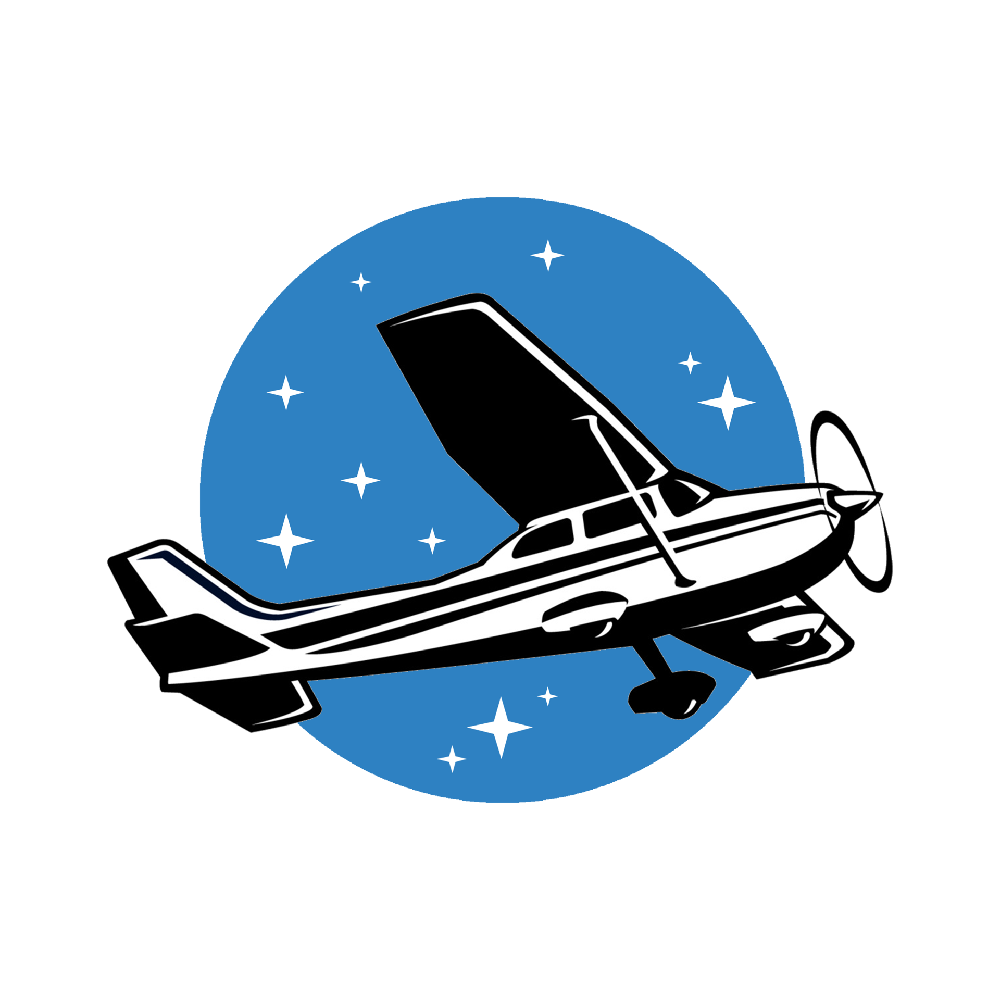

# AVIS - Simulador de Vuelo Inmersivo

  
  <h3>Ayudando a la formacion de futuros técnicos y pilotos</h3>
  
Simulador de vuelo realista e inmersivo con estructura movil e instrumentos funcionales

  
  <!-- Íconos de redes sociales -->

  &nbsp;&nbsp;&nbsp;&nbsp;
  &nbsp;&nbsp;&nbsp;&nbsp;
  

## 🌐 Accede a la Página Web

🔗 [Visita la Web de AVIS](https://lautarocabeza.github.io/proyecto.avis/)

## ✨ Ayudando a la formacion de Técnicos y Pilotos

AVIS es un simulador de vuelo educativo diseñado para proporcionar una experiencia inmersiva y realista de pilotaje de aeronaves, recreando con precisión la cabina de un Cessna 172, una de las aeronaves de entrenamiento más populares del mundo.

## 🔧 Características Principales

- **Estructura Movil**: Avis integra tecnología de movimiento físico para simular las sensaciones reales que experimenta un piloto durante el vuelo.
- **Cabina Realista**: La cabina será idéntica a la de la aeronave Cessna 172, proporcionando al futuro técnico/piloto aprender de forma realista.
- **Instrumentación Realista**: Los instrumentos de la aeronave funcionarán con el vuelo, ayudando al futuro piloto a aprender o permitiendo a profesores enseñar a alumnos.
- **Sofware Avanzado**: Incluye un programa de simulación profesional con físicas de vuelo realista, condiciones meteorológicas variables y escenarios de emergencia.
- **Experiencia Inmersiva**: Integra pantallas de alta resolución y un sistema de sonido que reproduce con precisión los sonidos de la aeronave y del ambiente.
- **Versátil**: Emula una variedad de situaciones, con locaciones reales y pistas reales en diversos lugares del mundo sin correr riesgos.
- **Certificación**: Se buscará la certificación del simulador para que se puedan sumar horas de vuelo para aprendices de piloto.

## 👨‍👩‍👦🛠️ Aplicaciones

- **Profesores de la Escuela**: Avis permite enseñarle a los estudiantes sobre instrumentación, sistemas de navegación, y demás características de la aeronave.
- **Pilotos en Formación**: Ayuda de forma segura y controlada a las personas que buscan aprender a pilotar.
- **Horas de Vuelo**: Con el simulador certificado permitiria a los pilotos sumar horas de vuelo usando nuestro producto.

## ⚡ Tecnología Utilizada

- **Hardware**:

  - Raspberry pi pico 2
  - Sensores de posición
  - Motores trifásicos con caja reductora
  - Estructura con movimiento en 2 ejes
  - Cabina con switches, pantallas y encoders
  - Volante de avión realista
  - Computadora para la simulacion

- **Software**:
  - Programación en C/C++ y Python
  - Integración de sistemas de la cabina en la simulación
  - Funcionamiento de periféricos como el volante en la simulación
  - Sincronización entre la simulación del avión y la cabina física

## 💸 Costos Estimados

El desarrollo de AVIS tiene un costo aproximado de **6000 USD**, incluyendo la estructura de metal, componentes electrónicos, motores, displays y tecnologías integradas.

## 📢 Contribución

Si deseas colaborar con el desarrollo de AVIS, puedes comunicarte al Mail:
simulador.avis@gmail.com

## Integrantes:

### Lautaro Cabeza

- 📷 Instagram: [@lautiicabezaa](https://www.instagram.com/lautiicabezaa)
- 📧 Mail: lautiicabezaaa@gmail.com
- 🌐 Github: [LautaroCabeza](github.com//LautaroCabeza)

### Bruno Colombo

- 📷 Instagram: [@brunoo.colombo](https://www.instagram.com/brunoo.colombo)
- 📧 Mail: bruno.colombo.genlot@gmail.com
- 🌐 Github: [brunoocolombo](https://github.com/brunoocolombo)

### Mateo Coria Reartes

- 📷 Instagram: [@coriaa.f1](https://www.instagram.com/coriaa.f1)
- 📧 Mail: mateocoria879@gmail.com
- 🌐 Github: [mateocoria02](https://github.com/mateocoria02)

### Natanael Robaina

- 📷 Instagram: [@natarobaina](https://www.instagram.com/natarobaina)
- 📧 Mail: natarob2006@outlook.com
- 🌐 Github: [Robaina1](https://github.com/Robaina1)

### Juan Pablo Rodriguez

- 📷 Instagram: [@juanka.rod](https://www.instagram.com/juanka.rod)
- 📧 Mail: juamppa@icloud.com
- 🌐 Github: [JuanPablo2905](https://github.com/JuanPablo2905)

### Vicente Seta

- 📷 Instagram: [@vicen_007](https://www.instagram.com/vicen_007)
- 📧 Mail: vicenseta@gmail.com
- 🌐 Github: [setavicente](https://github.com/setavicente)

### Luca Sturla

- 📷 Instagram: [@](https://www.instagram.com/)
- 📧 Mail: 
- 🌠Github: 

### Tomas Vogel

- 📷 Instagram: [@goyovogel](https://www.instagram.com/goyovogel)
- 📧 Mail: gregoriovogel@gmail.com
- 🌐 Github: [TomasGoyo](https://github.com/TomasGoyo)

---

Avis busca mejorar los metodos de aprendizaje en la escuela. ¡Sé parte de la revolución! 💪🛠

## 📜 Licencia

Este proyecto está licenciado bajo la [MIT License](LICENSE).  
© 2025 Avis.corp.
